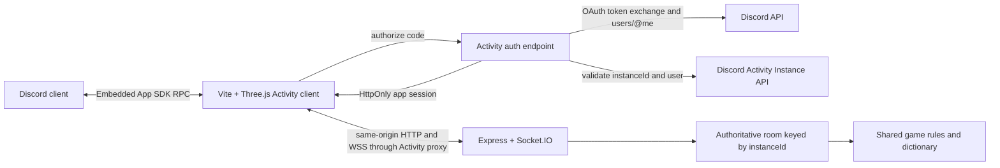

# Words & Wizards: Discord Activity Migration Plan

Status: core repository implementation complete; Discord Portal, staging, and production acceptance pending
Prepared: 2026-08-27
Repository snapshot: `main` at `56af577` with pre-existing local edits in `src/main.ts`, `src/network/api.ts`, `src/server/server.ts`, and `src/style.css`

Implementation handoff: [`discord-activity-implementation-handoff.md`](./discord-activity-implementation-handoff.md)

## Executive decision

Convert the existing browser game into a Discord Activity using Discord's **Embedded App SDK** (`@discord/embedded-app-sdk`). A Discord Activity is still a hosted web application running in a Discord iframe; this is not a rewrite into a desktop/native binary. Discord's Social SDK is intended for adding Discord social features to native games and is not the correct primary SDK for this Vite/Three.js application.

The existing architecture is a good base:

- Keep Three.js, GSAP, Vite, the shared rules, and the authoritative Node/Express/Socket.IO server.
- Replace browser OAuth redirects, user-entered identities, public room browsing, room codes, and copied browser invite URLs in Activity mode.
- Use the Discord SDK's `instanceId` as the key for one authoritative game room per Activity instance.
- Authenticate every participant through the Activity OAuth flow, verify the Discord user and Activity instance on the server, and derive the actor for every HTTP and Socket.IO action from the server session.
- Auto-join authenticated users to the room for their Activity instance. Use Discord's invite dialog to bring friends into that same instance.
- Preserve standalone/offline support only as an explicitly selected development or legacy mode. Production Activity behavior must not silently fall back when the SDK is unavailable.

This approach changes the platform and session boundary without rewriting the game itself.

## Current-state assessment

### What can be retained

| Area | Current implementation | Migration disposition |
| --- | --- | --- |
| Client rendering | Three.js `SpellcastGame` and `WordBoard` | Retain; add Discord layout/performance hooks |
| Animations and audio | GSAP and `SoundManager` | Retain; add lifecycle and thermal throttling |
| Rules | Shared façade over authoritative game state | Retain and continue treating the server as authoritative online |
| Realtime | Socket.IO room broadcasts | Retain; authenticate sockets and key rooms by Activity instance |
| Lobby/game controls | Host, kick, skip, rounds, spectators, chat | Retain behavior; remove client-supplied authority |
| Build/deployment | Vite client + Node server in one container | Retain the shape; update runtime and proxy configuration |
| Tests | Vitest shared/offline/server tests | Retain and expand with Activity auth and transport tests |

### Gaps that must be closed

1. `src/main.ts` is a large browser-oriented bootstrap that owns OAuth redirects, `localStorage` identity, history routes, room codes, public room listing, copied invite URLs, lobby UI, and game startup.
2. The current Discord login is a top-level redirect/callback flow. Activities must authorize through `discordSdk.commands.authorize`, exchange the code on the backend, and call `discordSdk.commands.authenticate` inside the iframe.
3. The server trusts `name`, `playerId`, and `requesterId` supplied by clients. A user can currently impersonate another player or exercise host actions by sending another ID.
4. Rooms are keyed by four-letter codes and exposed through `GET /api/rooms`. Activity users instead expect “Join Application” to enter their friends' shared `instanceId`.
5. API and Socket.IO CORS currently allow all origins. Production must be restricted to the Activity proxy origin and approved development origins.
6. Room state exists only in process memory. This requires one server replica for the first release, or a shared state/Socket.IO adapter before horizontal scaling.
7. The fixed `1100 x 620` canvas is scaled down as a single unit. It will be too small in Discord grid/PIP and on phones, and it does not use Discord safe-area variables.
8. Google Fonts and Font Awesome are loaded from external CDNs. They will be subject to the Activity proxy CSP and should be bundled locally.
9. The Docker build targets Node 18, which is end-of-life. Move the build and runtime to Node 24 LTS.
10. The current validation baseline is not fully green:
    - `npm test -- --run`: 17 tests pass.
    - `npm run typecheck`: fails at `src/main.ts:731` (`lobbyContext` possibly null) and `src/server/gameState.ts:202` (`WordMultiplier` is not in scope).

## Goals

- Launch Words & Wizards from Discord's App Launcher in a channel, DM, or group DM.
- Authenticate the current Discord user without a browser redirect or a name prompt.
- Put all users in the same Discord Activity instance into the same authoritative game room.
- Retain the current gameplay, scoring, host controls, spectators, chat, reconnect grace, animations, and audio unless a Discord constraint requires a change.
- Use Discord-native invite, participant, layout, orientation, close, and optional Rich Presence capabilities.
- Support desktop/web Discord first with a defined path to iOS and Android.
- Prevent normal browsers, spoofed player IDs, or users from another Activity instance from joining a production game session.
- Produce repeatable local, proxy, staging, and production validation workflows.

## Non-goals for the first Activity release

- Rewriting the game in React or another UI framework.
- Replacing Socket.IO with Discord RPC; the Embedded App SDK is not a game-state transport.
- Rewriting the rules or visual design.
- Enabling monetization, purchases, quests, or referrals.
- Enabling mobile in the Developer Portal before the mobile layout and performance gates pass.
- Supporting multiple backend replicas while room state remains in memory.

## Target architecture



### Authority model

| Concern | Authoritative source | Notes |
| --- | --- | --- |
| Discord user identity | Backend result from Discord OAuth/API | Never trust a name or user object sent by the client |
| Activity membership | Backend check of Discord's Activity Instance API | `instanceId` from the SDK is a claim until verified |
| Game room | Backend room keyed by verified `instanceId` | One Activity instance maps to one game room |
| Player ID | Verified Discord user ID | Stable across reloads and multiple sockets |
| Host | First joined player, then existing host-transfer logic | Do not infer host from a client request |
| Connected state | Authenticated Socket.IO presence | SDK participant events are useful context, not game authority |
| Turns, scores, gems, board, dictionary | Existing server/shared rules | Client remains presentation and input only |
| Layout, orientation, thermal state | Discord SDK events | Safe to use locally for presentation/performance |

## Product behavior in Activity mode

1. Discord launches the Activity at `/` and supplies the Activity context.
2. The client shows a branded loading state while the SDK becomes ready.
3. The client requests only the scopes required for the current release, initially `identify`.
4. The backend exchanges the authorization code, resolves the Discord user, validates the user in the supplied Activity instance, creates a short-lived app session, and returns the Discord access token for the SDK `authenticate` call.
5. The client authenticates the SDK and performs an idempotent join for the verified instance.
6. If no room exists, the backend creates it and makes the first participant host. Otherwise the user rejoins or is added using the existing mid-game spectator policy.
7. The lobby opens directly. It shows verified Discord display names and avatars. No login, name, room-code, or room-browser screens appear.
8. “Invite Friends” runs `openInviteDialog()`. Friends who accept enter the same Activity `instanceId` and auto-join the same game room.
9. “Leave” removes the player from the game room when appropriate and then calls `discordSdk.close(...)`. Closing Discord directly is handled as a disconnect with the existing grace period.
10. Reload/reconnect repeats authorization and idempotently resumes the same player by Discord user ID. Activity mode does not rely on `localStorage` player IDs.

## Implementation phases

Each phase has its own acceptance gate. Do not begin broad UI cleanup before the identity and instance tests demonstrate the new security model.

### Phase 0: Protect the baseline and repair existing gates

Tasks:

- Preserve the four pre-existing modified files. Commit them separately or create the implementation branch only after the owner decides how those edits should be recorded.
- Fix the two current TypeScript errors without changing behavior.
- Record Node 24 LTS in the local toolchain documentation and change both Docker stages from Node 18 to Node 24.
- Add a secret-free `.env.example`; do not copy values from the ignored `.env`.
- Add CI, if none exists, for `npm ci`, `npm run typecheck`, `npm test -- --run`, and `npm run build`.
- Run `npm audit` and address runtime vulnerabilities relevant to an internet-facing service. Avoid bundling unrelated dependency upgrades with the Activity integration.

Gate:

- Clean typecheck, 17 existing tests still pass, production build succeeds, and the current standalone game behavior is unchanged.

### Phase 1: Configure development and production Discord applications

Use separate Discord applications for local/staging and production so URL mappings, test-mode users, and credentials cannot collide.

Developer Portal tasks:

- Prefer reusing the existing production Discord application only if it is intended to become the public Words & Wizards Activity identity. Otherwise create a new app and retire the old OAuth application after migration.
- Enable Activities.
- Enable both User Install and Guild Install contexts.
- Keep the default `Launch` Entry Point command using Discord's launch handler for the first release.
- Add the required OAuth redirect placeholder for Activity authorization.
- Create/enable the application bot and store its token server-side for Activity Instance API validation.
- Set Max Participants to `6`, matching `MAX_PLAYERS`.
- Initially enable Web/Desktop only. Enable iOS and Android after Phase 7 passes.
- Configure landscape as the default phone/tablet orientation for the first mobile test build.
- Configure the URL mapping `/` to the host that serves the existing combined client/API/Socket.IO deployment. Because one origin serves everything, a root mapping covers hashed assets, `/api/*`, and `/socket.io/*`.
- For proxy-based local development, map `/` to a temporary HTTPS tunnel target. Reset mappings when a temporary domain is no longer controlled.
- Upload application icon, Activity cover art, embedded background, and optional preview video. Set the public Activity name, description, and participant count.
- Add public Terms of Service, Privacy Policy, and support links before distribution/discovery.

Environment contract:

```dotenv
# Public client value
VITE_DISCORD_CLIENT_ID=

# Server-only values
DISCORD_CLIENT_ID=
DISCORD_CLIENT_SECRET=
DISCORD_BOT_TOKEN=
DISCORD_PUBLIC_KEY=
SESSION_SECRET=

# Runtime
NODE_ENV=
PORT=

# Development/legacy only; omit in Activity production
VITE_ACTIVITY_MODE=
VITE_SERVER_URL=
```

Rules:

- Only `VITE_DISCORD_CLIENT_ID` may enter the browser bundle.
- Client secret, bot token, public-key validation configuration, session secret, access tokens, and refresh tokens must never be stored in source, browser storage, logs, or built assets.
- Production startup must fail if a required secret is absent or `SESSION_SECRET` is the current `changeme` fallback.

Gate:

- A minimal page from this repository launches inside the staging Discord app through the Activity proxy on desktop and web Discord.

### Phase 2: Add an Activity platform layer and bootstrap state machine

Add the current package version at implementation time and lock it in `package-lock.json`. The latest registry version observed while preparing this plan was `@discord/embedded-app-sdk` `2.5.0`.

Suggested files:

- `src/activity/activityPlatform.ts` — small interface consumed by UI/bootstrap code.
- `src/activity/discordActivityPlatform.ts` — real `DiscordSDK` implementation.
- `src/activity/standaloneActivityPlatform.ts` — explicit development/legacy adapter, never a production fallback.
- `src/activity/activityContext.ts` — normalized user, instance, channel/guild, participant, layout, and lifecycle types.
- `src/activity/bootstrapActivity.ts` — initialization state machine.
- `src/ui/activityLaunchView.ts` — loading, retryable error, unsupported-client, and fatal-session UI.

Refactor `src/main.ts` so it composes these modules instead of owning SDK/auth/session details. Extracting the existing landing overlay into `src/ui/landingOverlay.ts` is recommended, but do not combine this migration with a full UI rewrite.

Bootstrap sequence:

1. Construct `DiscordSDK` with `VITE_DISCORD_CLIENT_ID` and capture `instanceId`.
2. Await `ready()` and present a retry/close error state if the handshake fails.
3. Call `authorize` with `identify`, `response_type: "code"`, `prompt: "none"`, and a per-attempt state/nonce if supported by the selected flow.
4. POST the code and claimed `instanceId` to the backend exchange endpoint.
5. Keep the returned Discord access token in memory only and call `authenticate`.
6. Compare the SDK-authenticated user ID with the backend-authenticated user ID; abort on mismatch.
7. Fetch and subscribe to `ACTIVITY_INSTANCE_PARTICIPANTS_UPDATE`.
8. Subscribe through the SDK's backward-compatible layout-mode helper, plus orientation and thermal events where supported.
9. Join/resume the backend room, connect Socket.IO, and render the lobby.
10. Unsubscribe and release listeners when the app closes or restarts bootstrap.

Implementation rules:

- Production mode is selected by build/runtime configuration, not merely by query parameters that a user can spoof.
- A missing SDK handshake in production is a visible fatal state, not permission to enter a browser room.
- Wrap SDK calls behind feature checks and handle `INVALID_COMMAND` for older Discord clients.
- Do not add `guilds`, `guilds.members.read`, `applications.commands`, voice scopes, or `rpc.activities.write` until a feature actually needs them.
- Unit tests should inject a fake `ActivityPlatform`; they should not depend on a live Discord iframe.

Gate:

- Client tests cover ready, authorize, authenticate, retry, user mismatch, unsupported command, participant update, and cleanup paths without contacting Discord.

### Phase 3: Replace redirect OAuth with server-verified Activity sessions

Add a dedicated server module instead of extending the already large `src/server/server.ts`:

- `src/server/activityAuth.ts` — code exchange, Discord API calls, instance verification, session issuance.
- `src/server/activitySession.ts` — signed/opaque session parsing and Express/Socket.IO middleware.
- `src/server/discordApi.ts` — small typed client with timeouts, redacted errors, and 429 handling.

Proposed endpoint:

```http
POST /api/activity/auth/exchange
Content-Type: application/json

{
  "code": "single-use OAuth code",
  "instanceId": "Discord Activity instance ID"
}
```

Server flow:

1. Validate body size and shape.
2. Exchange the code at Discord's OAuth token endpoint using the server-only client secret.
3. Call Discord `/users/@me` with the returned bearer token.
4. Call `/applications/{applicationId}/activity-instances/{instanceId}` with the application bot token.
5. Require matching application ID, active instance, and the authenticated Discord user in the instance's `users` list.
6. Create a short-lived application session containing a random session ID, Discord user ID, verified instance ID, display name/avatar metadata snapshot, issued time, and expiration.
7. Set the application session in a `Secure`, `HttpOnly` cookie visible to the proxied Activity origin. Choose and integration-test `SameSite` behavior through the actual Discord proxy rather than assuming direct-browser cookie behavior.
8. Return only the Discord access token required by `discordSdk.commands.authenticate` plus the same normalized user summary. The access token remains memory-only in the client.

Security controls:

- Derive all actors from the validated app session. Never accept an acting `playerId` or `requesterId` from a request body or socket auth payload.
- Use a short session TTL and re-run the Activity bootstrap when it expires.
- Reject sessions whose instance differs from the requested room.
- Add Discord API timeouts, bounded retries for rate limits, and sanitized logs. Never log codes, access tokens, cookies, bot tokens, or secrets.
- Restrict HTTP and Socket.IO origins to the production `<application_id>.discordsays.com` origin and explicit development origins.
- Add request rate limits for auth exchange, joins, room mutations, chat, and gameplay events.
- Make optional Discord proxy signature validation a defense-in-depth task after the core OAuth/instance validation is working.
- Keep the legacy `/auth/discord/login`, callback, and cookie flow only behind explicit standalone mode during transition; remove it after the standalone product decision is final.

Gate:

- Server tests prove that invalid/replayed codes, expired sessions, user mismatches, nonexistent instances, users outside the instance, and cross-instance access are rejected.
- A normal browser cannot create or join a production Activity room.

### Phase 4: Make multiplayer instance-native and remove client authority

Data-model changes:

- Add `activityInstanceId` to `Room` or use it as the room's internal ID. Do not expose it as a user-entered room code.
- Use the verified Discord user ID as `Player.id` and add optional `avatar`, `username`, and `globalName` fields.
- Add `lastActiveAt` and an explicit room lifecycle state if needed for cleanup.
- Keep `MAX_PLAYERS = 6`, spectator behavior, scores, gems, and host-transfer rules.

HTTP surface in Activity mode:

```text
POST   /api/activity/room/join             idempotently create/join the session's instance room
GET    /api/activity/room                  return the session's current room
POST   /api/activity/room/start            host from session only
PATCH  /api/activity/room/settings         host from session only
POST   /api/activity/room/leave            leave current room
DELETE /api/activity/room/players/:userId  host may remove another player
```

Socket.IO changes:

- Authenticate the Socket.IO handshake with the same application session cookie.
- Derive `instanceId` and `playerId` on the server; remove `{ roomId, playerId }` from client socket auth.
- Join the verified instance room and register presence idempotently.
- For every game, chat, kick, skip, or settings action, resolve the actor from the socket session.
- Keep one player record for multiple sockets belonging to the same Discord user.
- Preserve the disconnect grace period. Reconnecting with the same Discord user/instance must resume the existing player rather than create a duplicate.
- Treat `ACTIVITY_INSTANCE_PARTICIPANTS_UPDATE` as UI/context data only. Socket presence and the backend room remain authoritative for game membership and connected state.

Retire or hide in Activity mode:

- `GET /api/rooms` and the public room list.
- Four-letter room creation/join flows.
- `/room/:roomId` history routes and copied share URLs.
- `localStorage` room/player identity.
- Client-supplied names and actor IDs.

Room lifecycle:

- When the final authenticated player leaves or the disconnect grace expires, delete the in-memory room after a short idle TTL.
- Never reuse Discord `instanceId` values as new sessions; Discord defines them as lifecycle-specific.
- For the MVP, deploy exactly one backend replica and document that a restart ends active games.
- Before horizontal scaling or a public reliability SLA, add a shared authoritative store and the Socket.IO Redis adapter, distributed locks/versioning for room mutations, and restart recovery tests. Merely adding the Socket.IO adapter is insufficient while the `rooms` map remains process-local.

Gate:

- Integration tests cover auto-create, two users in one instance, isolation between two instances, idempotent reload, multiple sockets, host transfer, host-only actions, kick, spectator join, disconnect/reconnect, full room, and final-room cleanup.

### Phase 5: Replace browser lobby UX with Discord-native UX

Activity-mode UI changes:

- Replace the login/logout/name/create/join/rooms landing screens with Activity loading, session error, and instance lobby states.
- Render Discord global display name and avatar. Continue assigning text via `textContent`; Discord-provided strings are untrusted display data.
- Replace the copied browser room URL with an “Invite Friends” button that calls `openInviteDialog()`.
- Replace the hard-coded Discord server `window.open` call with `openExternalLink()` if the community-server link remains.
- Replace the game exit event's browser navigation with an Activity-aware leave-and-close sequence.
- Keep rounds, lobby chat, host kick, host skip, spectators, and start-game controls initially. Re-evaluate in-Activity text chat later because Discord already supplies surrounding chat/voice.
- Add a clear “Reconnecting” state that does not accidentally create a second player.
- Keep offline play outside the production Activity flow for the first release. It can remain available in explicit standalone development mode until a deliberate in-Activity practice design is chosen.

Optional native polish after the core gate:

- Request `rpc.activities.write` and call `setActivity` for states such as “In Lobby”, “Round 2 of 5”, and party size. Keep this optional so a Rich Presence failure cannot block gameplay.
- Offer `encourageHardwareAcceleration()` only after detecting a WebGL/performance problem on a supported desktop client; do not show the modal on every launch.
- Use `shareLink` or the share-moment flow only for a future score/result sharing feature.

Gate:

- No Activity user sees a browser OAuth redirect, name field, room code, room browser, or copied web invite link.
- Inviting another user through Discord joins the same lobby and starts a synchronized game.

### Phase 6: Make all networking and assets proxy-safe

Networking:

- Keep client API and Socket.IO URLs same-origin and relative in production. With `/` mapped to the combined deployment, requests flow through the Discord proxy without hard-coded public backend URLs.
- Validate HTTP, WebSocket upgrade, Socket.IO reconnect, and long-running connections through the actual proxy. A direct local browser test is not equivalent.
- Use `patchUrlMappings` only if a third-party library emits an unavoidable external URL. It patches global `fetch`, `WebSocket`, and XHR and should not be the default for the existing same-origin stack.
- Add explicit request timeouts and Activity-friendly retry UI for API and socket failures.

Assets and CSP:

- Download/license and bundle the `Play` font, or select a bundled/system fallback. Remove both Google Fonts loads.
- Bundle the icons locally or replace Font Awesome classes with local SVG/icon components. Remove the cdnjs stylesheet.
- Keep game images, dictionary, and audio in the Vite asset graph so Vite emits hashed filenames.
- Confirm MIME types and cache headers for `.m4a`, fonts, images, JavaScript, CSS, and WebSocket responses.
- Retain Vite's hashed asset names as the cache-busting strategy and ensure HTML is not cached as immutable.

Gate:

- The browser console and Discord Activity logs contain no `blocked:csp`, mixed-content, missing asset, MIME, WebSocket, or cross-origin errors during a full game and reconnect.

### Phase 7: Adapt layout, input, and performance to Discord surfaces

The current global scaling preserves appearance but makes controls illegibly small on constrained surfaces. Replace “scale the entire 1100 x 620 app” as the only strategy with responsive layout states.

Tasks:

- Add CSS variables that prefer Discord safe-area insets and fall back to browser `env(safe-area-inset-*)` values.
- Treat focused, grid, and PIP as explicit UI modes using the SDK's backward-compatible layout subscription helper.
- Focused desktop: retain the full board/sidebar composition.
- Grid: keep the board and turn/score essentials; collapse secondary controls and chat/log actions.
- PIP: show a compact read-only summary or minimal playable view, depending on input viability; throttle expensive particles and nonessential animation.
- Mobile landscape: reflow the sidebar, enlarge touch targets, avoid hover-only behavior, test keyboard/modal safe areas, and ensure board selection is reliable.
- Do not force `devicePixelRatio` up to `2` under thermal/performance pressure. Add a renderer quality policy that can lower pixel ratio and particle density.
- Subscribe to thermal-state updates on mobile and degrade effects at serious/critical states.
- Pause or reduce the animation loop, audio, and timers when the document is hidden or the Activity is minimized, while preserving authoritative server timing.
- Dispose Three.js/GSAP/audio resources and SDK listeners on exit/re-bootstrap to avoid duplicate loops after reconnect.

Gate:

- Focused, grid, and PIP modes are usable in Discord desktop/web.
- Mobile is enabled only after representative iOS and Android devices pass safe-area, orientation, touch, reconnect, audio unlock, thermal, and performance checks.

### Phase 8: Testing, observability, and security verification

Automated tests:

- Activity platform unit tests with a fake SDK adapter.
- Auth endpoint tests with mocked Discord OAuth, user, rate-limit, and Activity Instance API responses.
- Session-cookie, expiration, origin, replay, and cross-instance tests.
- HTTP authorization tests proving body-supplied IDs cannot change the actor.
- Socket.IO integration tests for handshake auth and every privileged event.
- Existing rules/offline/server regression tests.
- Client smoke tests for launch -> auth -> lobby -> invite -> join -> start -> play -> result -> leave.

Manual matrix:

| Surface | Required scenarios |
| --- | --- |
| Discord desktop | fresh launch, invite, two users, WebGL, audio, grid/PIP, reload, reconnect, host leave |
| Discord web | same flow, browser privacy settings, cookie behavior, WebSocket reconnect |
| Normal browser | production access rejected; explicit standalone dev mode still works if retained |
| iOS/Android | later gate: safe areas, landscape, touch, keyboard, background/resume, thermal |
| Two instances | no state, chat, presence, or authorization leakage between instances |
| Deployment restart | documented MVP behavior; recovery behavior after shared state is implemented |

Observability:

- Generate correlation IDs for launch/session/room operations without logging tokens or full cookies.
- Record SDK-ready duration, auth-exchange success/failure class, room join latency, socket connect/reconnect, disconnect reason, and server action rejection counts.
- Add health/readiness endpoints that verify process readiness without exposing room/user data.
- Add structured server error codes so the client can distinguish expired session, invalid instance, room full, permission denied, and transient Discord/API failure.
- Forward useful client errors to the chosen telemetry service through an allowed proxy mapping, or use Discord's Activity logging during development.

Security review gate:

- Inspect the built client bundle for secrets.
- Verify production refuses startup with development defaults.
- Verify normal browsers and forged SDK claims cannot obtain a game session.
- Verify no endpoint or socket event trusts a client actor ID.
- Verify CSP/origin policy, rate limits, payload limits, chat sanitization, dependency audit, and log redaction.

### Phase 9: Deployment and release

Deployment tasks:

- Build client and server in CI using Node 24 LTS and `npm ci`.
- Run typecheck, tests, build, and container smoke tests before image publication.
- Serve the Vite client, Activity auth routes, REST game API, and Socket.IO from one HTTPS host for the simplest root URL mapping.
- Ensure the hosting provider supports WebSocket upgrades, sticky behavior if applicable, graceful shutdown, and a single replica while state is in memory.
- Configure staging and production secrets in the hosting platform, not repository files.
- Deploy staging, update the staging Activity mapping, and complete proxy/manual validation.
- Deploy production, update the production mapping, and smoke-test with a restricted test cohort before broader distribution.
- Verify Activity metadata, artwork, max participants, installation contexts, Entry Point command, supported platforms, Privacy Policy, Terms, and support contact.
- Document rollback: revert the URL mapping to the previous known-good deployment and keep schema/session changes backward compatible for at least one deployment window.

Release gate:

- All automated gates pass.
- A six-user staging session can launch through Discord, invite, play a complete game, reconnect, transfer host, and exit with no cross-instance or CSP failures.
- The deployment model is explicitly declared as either single-replica/ephemeral or shared-state/multi-replica.

## Expected file-level change set

| Path | Planned change |
| --- | --- |
| `package.json`, `package-lock.json` | Add Embedded App SDK and targeted server validation/rate-limit dependencies if selected |
| `src/main.ts` | Reduce to composition; replace browser-first startup with Activity bootstrap |
| `src/activity/*` | New SDK adapter, context, bootstrap, event/lifecycle handling |
| `src/ui/*` | Extract landing/lobby launch states and Activity error UI |
| `src/network/api.ts` | Add session-bound Activity room API; remove actor IDs from Activity calls |
| `src/network/socket.ts` | Same-origin connection authenticated by app session, not room/player IDs |
| `src/server/activityAuth.ts` | OAuth exchange, `/users/@me`, Activity instance validation |
| `src/server/activitySession.ts` | Express and Socket.IO session middleware |
| `src/server/discordApi.ts` | Typed Discord API wrapper with redaction, timeout, rate-limit behavior |
| `src/server/server.ts` | Mount new routers/socket middleware; retire or gate legacy OAuth and room list |
| `src/server/types.ts` | Discord identity, instance, session, and lifecycle fields |
| `src/style.css` | Safe areas, focused/grid/PIP/mobile layouts, Activity launch states |
| `index.html` | Remove external font/icon CDN dependencies |
| `Dockerfile` | Node 24 LTS build/runtime and production hardening |
| `.env.example` | Secret-free environment contract |
| `tests/activity/*` | SDK adapter/bootstrap tests |
| `tests/server/*` | Auth/session/instance/API/socket integration tests |
| `README.md` | Activity setup, development, deployment, and standalone-mode documentation |

## Recommended pull-request sequence

1. **Baseline and runtime:** repair typecheck, add CI and `.env.example`, move to Node 24.
2. **SDK shell:** add the Activity adapter/bootstrap behind a development flag with fake-SDK tests.
3. **Verified auth:** add Activity OAuth exchange, instance validation, and app sessions.
4. **Instance rooms:** key rooms by `instanceId`, authenticate Socket.IO, remove client actor authority.
5. **Activity UX:** auto-join lobby, verified profiles, invite/close/external-link commands, hide browser room flows.
6. **Proxy and assets:** same-origin proxy validation, self-hosted assets, CSP cleanup.
7. **Layout/performance:** focused/grid/PIP, safe areas, mobile/thermal policies.
8. **Production hardening:** telemetry, rate limits, security checks, staging soak, release metadata.
9. **Scale track when needed:** shared room state, Redis adapter, distributed mutation/version tests, restart recovery.

Every PR should keep typecheck, tests, and build green and should be independently rollback-safe.

## Decisions to confirm before implementation

These do not block the architecture, but they affect product scope:

1. **Discord application:** reuse the existing OAuth app or create a new public Activity app. Recommendation: reuse it only if its name, ownership, bot, and public identity are already correct.
2. **Standalone browser build:** keep as a supported product or development-only fallback. Recommendation: development/legacy mode only until there is a clear reason to operate two login and room systems.
3. **Offline practice inside Discord:** omit from the first Activity release or design how it coexists with shared-instance joins. Recommendation: omit initially while preserving the code.
4. **In-Activity text chat:** retain or rely on Discord channel/DM chat. Recommendation: retain for behavioral parity, then evaluate usage.
5. **First mobile release:** launch desktop/web first or include mobile. Recommendation: desktop/web first; enable mobile only after Phase 7.
6. **Availability target:** accept active-game loss on a deploy/restart or fund shared persistence now. Recommendation: state the single-replica limitation for a private MVP; implement shared state before a broad public launch/SLA.
7. **Rich Presence:** add `rpc.activities.write` at first launch or later. Recommendation: later, so MVP authorization requests only `identify`.

## Definition of done

The conversion is complete when:

- The game launches from Discord's App Launcher through the production Activity proxy.
- SDK ready/authorize/authenticate succeeds without leaving the iframe.
- The backend independently verifies Discord identity and active-instance membership.
- The same `instanceId` always resolves to the same live authoritative room, and different instances are isolated.
- No game mutation trusts a client-provided acting player ID.
- Users auto-join with their Discord identity, can invite friends through Discord, play a complete synchronized game, reconnect, and leave/close cleanly.
- Activity mode has no browser login, room code, public room list, copied web invite, or localStorage security dependency.
- Client assets, REST, Socket.IO, fonts, icons, audio, and images work through the proxy with no CSP errors.
- Focused/grid/PIP layouts pass; any enabled mobile platform also passes its dedicated gate.
- Existing game-rule tests and all new Activity/auth/integration tests pass with a clean typecheck and production build.
- Secrets are absent from source and built assets; normal-browser/spoofed/cross-instance access is rejected.
- Deployment topology, restart behavior, monitoring, rollback, metadata, legal links, and support ownership are documented.

## Primary references

- [Discord Activities overview](https://docs.discord.com/developers/activities/overview)
- [How Discord Activities work](https://docs.discord.com/developers/activities/how-activities-work)
- [Building your first Activity](https://docs.discord.com/developers/activities/building-an-activity)
- [Embedded App SDK reference](https://docs.discord.com/developers/developer-tools/embedded-app-sdk)
- [Local development and URL mappings](https://docs.discord.com/developers/activities/development-guides/local-development)
- [Activity networking and security](https://docs.discord.com/developers/activities/development-guides/networking)
- [Multiplayer instances and participants](https://docs.discord.com/developers/activities/development-guides/multiplayer-experience)
- [Activity user actions and invite dialog](https://docs.discord.com/developers/activities/development-guides/user-actions)
- [Layout modes and orientation](https://docs.discord.com/developers/activities/development-guides/layout)
- [Mobile safe areas and thermal states](https://docs.discord.com/developers/activities/development-guides/mobile)
- [Activity assets and metadata](https://docs.discord.com/developers/activities/development-guides/assets-and-metadata)
- [Production readiness](https://docs.discord.com/developers/activities/development-guides/production-readiness)
- [Official Embedded App SDK examples](https://github.com/discord/embedded-app-sdk-examples)
- [Embedded App SDK package](https://www.npmjs.com/package/@discord/embedded-app-sdk)
- [Node.js release status](https://nodejs.org/en/about/previous-releases)
